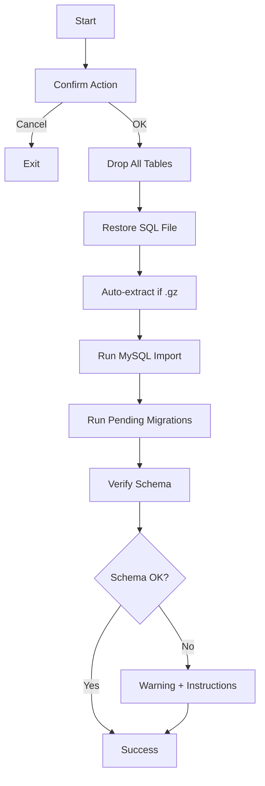

# Panduan Restore Database dengan Schema Baru

## Masalah

Saat restore backup SQL lama, tabel tidak punya kolom baru yang ditambahkan di development terbaru:
- `stock_opnames.status`
- `stock_opnames.journal_entry_id`
- Dan kolom/tabel baru lainnya

## Solusi: Safe Restore

Gunakan command `db:safe-restore` yang otomatis:
1. ✅ Restore SQL backup
2. ✅ Run pending migrations
3. ✅ Verify schema

## Cara Pakai

### Via Command (RECOMMENDED)

```bash
# Format
docker compose exec app php artisan db:safe-restore /path/to/backup.sql

# Contoh dengan file .sql
docker compose exec app php artisan db:safe-restore storage/app/db-backups/backup-2025-12-31.sql

# Contoh dengan file .gz (akan auto-extract)
docker compose exec app php artisan db:safe-restore storage/app/db-backups/backup-2025-12-31.sql.gz
```

**Output:**
```
🔄 Starting safe database restore...

This will DROP all tables and restore from backup. Continue? (yes/no):
> yes

Step 1: Restoring SQL backup...
✅ SQL restored successfully

Step 2: Running pending migrations...
  2026_01_01_090046_add_status_and_journal_to_stock_opnames .... DONE
✅ Migrations completed

Step 3: Verifying schema...
✅ stock_opnames table has all required columns
✅ journal_entries table exists

✅ Database restored successfully!
You can now use the application with all new features.
```

### Manual Restore (OLD WAY - Not Recommended)

Jika tetap ingin manual:

```bash
# 1. Restore SQL
docker compose exec app mysql -u root -p apoteku < backup.sql

# 2. WAJIB run migrations setelahnya!
docker compose exec app php artisan migrate --force
```

## Verification

Setelah restore, cek:

```bash
# Cek kolom stock_opnames
docker compose exec app php artisan tinker --execute='
DB::select("SHOW COLUMNS FROM stock_opnames");
'

# Pastikan ada:
# - status
# - journal_entry_id
```

## Troubleshooting

### Error: "Unknown column 'stock_opnames.status'"

**Penyebab:** Restore SQL tanpa run migration

**Solusi:**
```bash
docker compose exec app php artisan migrate --force
```

### Error: "Table 'journal_entries' doesn't exist"

**Penyebab:** Database terlalu lama, tidak ada tabel journal

**Solusi:**
```bash
# Run all migrations dari awal
docker compose exec app php artisan migrate:fresh --force
# Lalu restore data via seeder atau manual
```

### Command tidak ketemu

**Penyebab:** Perlu run composer autoload

**Solusi:**
```bash
docker compose exec app composer dump-autoload
docker compose exec app php artisan list | grep restore
```

## Best Practice

### Before Backup
```bash
# Always include schema changes in backup
docker compose exec app php artisan backup:auto
```

### Before Restore
```bash
# 1. Pastikan code sudah latest
git pull

# 2. Composer update
docker compose exec app composer install

# 3. Restore dengan safe command
docker compose exec app php artisan db:safe-restore backup.sql
```

## Technical Details

### Safe Restore Process



### What Migrations Do

Migrations menambahkan kolom baru tanpa menghapus data existing:

```sql
-- Example: Migration menambah kolom status
ALTER TABLE stock_opnames 
ADD COLUMN status ENUM('draft', 'finalized') DEFAULT 'draft';

-- Data lama tetap aman, kolom baru terisi default value
```

## Notes

- ✅ **Safe:** Data tidak hilang saat migration
- ✅ **Automatic:** Kolom baru terisi default value
- ✅ **Backward Compatible:** SQL lama tetap bisa di-restore
- ⚠️ **Warning:** Selalu backup sebelum restore!

## Support

Jika ada masalah, cek log:
```bash
docker compose exec app tail -f storage/logs/laravel.log
```
